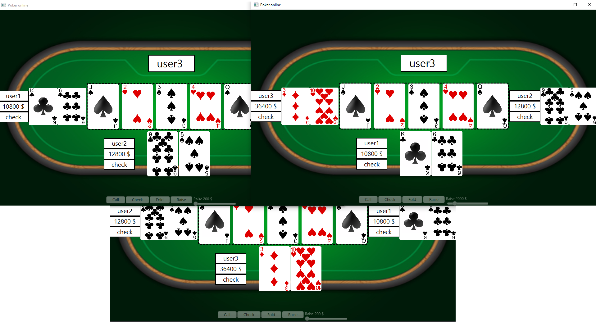

# PokerOnline
Poker Online using Java, JavaFX and Socket programming.
First start the server, then 3 clients. When all of them are logged in and press Play, you can start the game.

## Login screen

## Game start

## Flop

## Pick winner

